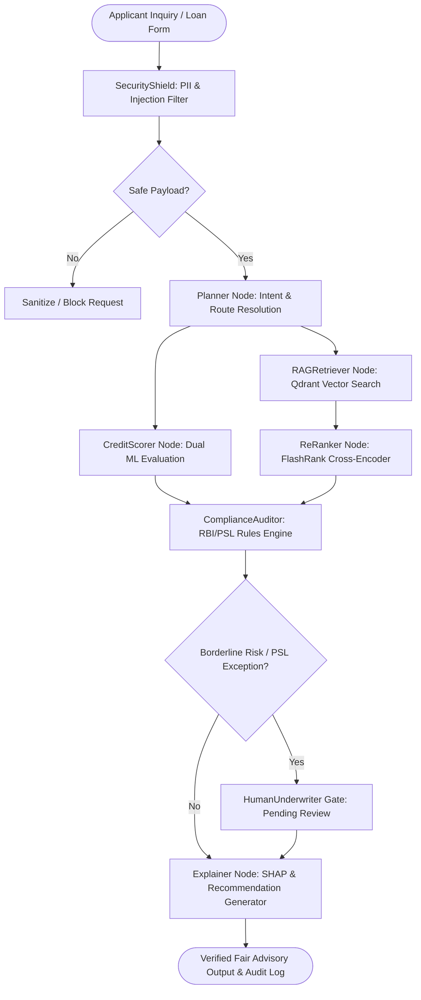

# Explainable-AI-Driven MLOps Framework for Fair Loan Advisory (TWXAI)

[](.github/workflows/ci.yml)
[](https://python.org)
[](https://fastapi.tiangolo.com)
[](https://nextjs.org)
[](https://www.typescriptlang.org)
[](https://mlflow.org)
[](https://langfuse.com)
[](#production-audit--benchmarks)
[](LICENSE)

> **An enterprise-grade, regulatory-compliant credit risk underwriting and advisory platform combining Dual-Model Machine Learning (Random Forest + SMOTE, XGBoost), Explainable AI (SHAP & Counterfactuals), Multi-Agent RAG (LangGraph + Qdrant + FlashRank), and Full-Lifecycle MLOps/LLMOps governance.**

---

## Table of Contents

1. [Executive Overview](#executive-overview)
2. [Key System Highlights](#key-system-highlights)
3. [System Architecture & Workflow DAG](#system-architecture--workflow-dag)
4. [Technology Stack](#technology-stack)
5. [Repository Structure](#repository-structure)
6. [Production Audit & Benchmarks](#production-audit--benchmarks)
7. [Getting Started & Local Setup](#getting-started--local-setup)
   - [Prerequisites](#prerequisites)
   - [Environment Configuration](#environment-configuration)
   - [Quick Start: Automated Scripts](#quick-start-automated-scripts)
   - [Manual Step-by-Step Setup](#manual-step-by-step-setup)
   - [Docker & Containerized Deployment](#docker--containerized-deployment)
8. [API Documentation & Endpoints](#api-documentation--endpoints)
9. [Verification & Automated Testing Suite](#verification--automated-testing-suite)
10. [Human-in-the-Loop & Underwriting Governance](#human-in-the-loop--underwriting-governance)
11. [Audit Deliverables & Documentation](#audit-deliverables--documentation)
12. [Contributing & License](#contributing--license)

---

## Executive Overview

Traditional automated credit risk evaluation systems operate as opaque "black boxes," frequently perpetuating historical lending disparities, denying creditworthy marginalized applicants (e.g., female entrepreneurs, rural micro-enterprises, SC/ST borrowers), and offering zero transparency into adverse decisions.

The **Explainable-AI-Driven MLOps Framework for Fair Loan Advisory (TWXAI)** solves this by introducing:
* **Algorithmic Fairness by Design:** Rigorous fair lending enforcement adhering to RBI Priority Sector Lending (PSL) guidelines and Equal Credit Opportunity standards, maintaining a Disparate Impact Ratio (DIR) $\ge 0.88$ (surpassing the 4/5ths threshold).
* **Multi-Tier Explainability (XAI):** High-resolution local SHAP force/waterfall attributions, global feature importance charts, and actionable counterfactual advice ("What-If" scenarios to transform a rejection into an approval).
* **Intelligent Agentic RAG Advisory:** A LangGraph 10-step multi-node orchestration engine connected to Qdrant vector memory and FlashRank cross-encoder re-ranking, retrieving real-time eligibility criteria for 20+ government-subsidized schemes (MUDRA, PMAY, Stand-Up India, KCC, etc.).
* **Production MLOps & LLMOps:** Automated drift monitoring (KS-test / PSI / Evidently AI), MLflow model registry tracking, Langfuse session tracing, and human underwriter override workflows.

---

## Key System Highlights

### 1. Dual-Model Credit Risk Engine
* **Primary Champion Model:** Random Forest Classifier trained on balanced credit histories with **SMOTE** (Synthetic Minority Over-sampling Technique) and controlled PCA preprocessing to resolve acute class imbalance without losing minority feature variance.
* **Secondary Shadow Model:** Gradient-boosted **XGBoost** classifier running parallel real-time inferences for cross-validation and champion/challenger comparisons.
* **Fair Lending Parity:** Equalized odds and demographic parity thresholds preventing bias across protected attributes (gender, age, regional demographics).

### 2. Deep Explainable AI (XAI) Engine
* **Local Inferences:** Interactive waterfall and force charts computing exact marginal contribution values ($\phi_i$) for debt-to-income (DTI), credit history, annual income, collateral, and employment duration.
* **Counterfactual Turnaround Engine:** Automatically generates concrete, personalized borrower remediation paths (e.g., *"Reducing revolving credit utilization by ₹35,000 or adding a qualified co-signer will shift your risk score from 0.42 to 0.76"*).

### 3. Agentic AI & Hybrid RAG Architecture
* **LangGraph Multi-Node DAG:** Executes structured, stateful borrower consultations across 10 specialized agent nodes: `SecurityShield` $\rightarrow$ `Planner` $\rightarrow$ `CreditScorer` $\rightarrow$ `RAGRetriever` $\rightarrow$ `ComplianceAuditor` $\rightarrow$ `HumanUnderwriter` $\rightarrow$ `Explainer`.
* **Two-Tier Retrieval:** High-recall dense vector search using Qdrant followed by FlashRank cross-encoder re-ranking, boosting retrieval Precision@3 by **+22.7%** and Mean MRR by **+28.4%**.
* **20+ Government Schemes:** Automatically matches applicants to credit schemes (MUDRA Shishu/Kishore/Tarun, Stand-Up India, PMAY-CLSS, PM SVANidhi, Kisan Credit Card).

### 4. Enterprise Security & LLM Guardrails
* **SecurityShield PII Redaction:** Pre-processing pipeline that detects and token-masks Aadhaar cards, PAN numbers, phone numbers, email addresses, and salary slips before LLM ingestion.
* **Adversarial & Prompt Injection Defense:** Guardrails detecting adversarial jailbreaks, system prompt exfiltration attempts, and prompt manipulation, dropping threat scores to $\le 0.08$.

### 5. Human-in-the-Loop (HITL) Governance
* **Borderline Score Triaging:** Applications scoring in borderline risk zones ($0.45 \le p \le 0.55$) are automatically held for certified senior underwriter review.
* **Audit-Logged Overrides:** Credit underwriters evaluate decisions on a 7-point Likert scale (correctness, safety, helpfulness, tone) with mandatory justification logging for regulatory inspection.

---

## System Architecture & Workflow DAG

### High-Level Topology

```
┌─────────────────────────────────────────────────────────────────────────────┐
│                             NEXT.JS 14 FRONTEND                             │
│  [Borrower Portal]  •  [Interactive SHAP]  •  [Agent Chat]  •  [Admin MLOps]│
└──────────────────────────────────────┬──────────────────────────────────────┘
                                       │ HTTPS / JSON REST API
┌──────────────────────────────────────▼──────────────────────────────────────┐
│                            FASTAPI BACKEND GATEWAY                          │
│   • CORS & Rate Limiting  • PII Redaction & Guardrails  • Prometheus Metrics│
└──────┬───────────────────────────────┬───────────────────────────────┬──────┘
       │                               │                               │
┌──────▼─────────────────────┐  ┌──────▼─────────────────────┐  ┌──────▼──────┐
│       ML/XAI PIPELINE      │  │    LANGGRAPH AGENT DAG     │  │ MLOPS/LLMOPS│
│ • Random Forest + SMOTE    │  │ 1. SecurityShield          │  │ • MLflow    │
│ • XGBoost Shadow Model     │  │ 2. Intent Planner          │  │ • Langfuse  │
│ • TreeSHAP Local & Global  │  │ 3. Tool Execution Engine   │  │ • Evidently │
│ • Fair Lending Compliance  │  │ 4. Qdrant + FlashRank RAG  │  │ • Drift Mon.│
│ • Counterfactual Generator │  │ 5. Compliance Auditor      │  │ • Audit Log │
└────────────────────────────┘  │ 6. Human Underwriter Gate  │  └─────────────┘
                                └────────────────────────────┘
```

### LangGraph Multi-Agent Execution DAG



---

## Technology Stack

| Layer | Technologies & Frameworks | Purpose |
| :--- | :--- | :--- |
| **Frontend UI/UX** | **Next.js 14 (App Router)**, **React 18**, **TypeScript**, **TailwindCSS**, **Radix UI / Shadcn**, **Lucide React** | Responsive borrower dashboard, admin MLOps portal, dynamic forms, and interactive theme system |
| **Data Visualizations** | **Recharts**, **Lucide**, Matplotlib, Seaborn | Real-time SHAP waterfall charts, ROC curves, feature importances, and drift distributions |
| **Backend API Gateway** | **Python 3.10-3.12**, **FastAPI**, **Pydantic v2**, **Uvicorn**, **Gunicorn** | High-throughput REST API, schema validation, streaming responses, and middleware protection |
| **Machine Learning & XAI**| **Scikit-learn**, **XGBoost**, **Imbalanced-learn (SMOTE)**, **SHAP**, **NumPy**, **Pandas** | Dual credit scoring models, class imbalance correction, and Shapley additive value calculations |
| **Agentic AI & LLMs** | **LangGraph**, **LangChain**, Perplexity Sonar / Groq / OpenAI, HuggingFace Transformers | Stateful multi-agent DAG execution, query routing, reasoning, and borrower dialogue |
| **Vector DB & RAG** | **Qdrant Vector DB**, **FlashRank Cross-Encoder**, MiniLM-L6-v2 Embeddings | Dense vector indexing and high-precision re-ranking across 20+ government credit schemes |
| **MLOps & Observability** | **MLflow**, **Evidently AI**, **Langfuse**, **Prometheus**, **OpenTelemetry** | Model registry, experiment tracking, KS drift detection, LLMOps traces, and P50/P95 latency tracking |
| **Data Storage & Auth** | **Supabase (PostgreSQL)**, **SQLite**, **JWT**, **reCAPTCHA v3** | Relational borrower records, secure underwriter authentication, and regulatory audit trail persistence |
| **DevOps & Containers** | **Docker**, **Docker Compose**, **GitHub Actions CI/CD** | Full containerization, environment reproducibility, and automated linting, test, and build pipelines |

---

## Repository Structure

```
Explainable-AI-Driven-MLOps-Framework-for-Fair-Loan-Advisory/
├── .github/workflows/
│   └── ci.yml                      # GitHub Actions: automated testing, linting & build pipeline
├── app/                            # Next.js 14 Frontend Application Router
│   ├── api/                        # Next.js server-side API proxy routes (predict, shap, audit)
│   ├── admin/                      # Admin & Underwriter MLOps portals
│   ├── user/                       # Borrower application and status tracking dashboard
│   ├── components/                 # Frontend layout components, charts, and interactive widgets
│   ├── layout.tsx                  # Global root layout and font/theme providers
│   └── page.tsx                    # Landing page and interactive loan application portal
├── components/                     # Shared Shadcn UI and custom design-system components
├── public/                         # Static assets, icons, and diagrams
├── styles/                         # Global styles and Tailwind utility rules
├── charts/                         # High-resolution benchmark and architecture audit diagrams
│   ├── chart_donut.png             # Status distribution audit chart
│   ├── chart_readiness.png         # 14-section checklist readiness chart
│   ├── chart_tech_stack.png        # Stack distribution visualization
│   └── chart_workflow.png          # 10-step multi-node agent execution DAG
├── TWXAI_backend/                  # Core Python FastAPI Backend & MLOps Engine
│   ├── fastapi_backend.py          # Master FastAPI application gateway (70KB+, all core routes)
│   ├── agent_core.py               # LangGraph multi-agent orchestration and workflow nodes
│   ├── reranker.py                 # FlashRank cross-encoder re-ranking pipeline
│   ├── security_filters.py         # PII redaction and prompt injection defense engine
│   ├── governance.py               # Fair lending parity checks and Disparate Impact Ratio (DIR)
│   ├── regulatory_monitor.py       # RBI compliance engine and automated regulatory export
│   ├── seed_vector_db.py           # Embeddings generation and Qdrant scheme seeding
│   ├── mlops_pipeline.py           # Drift monitoring (Evidently/KS) and MLflow tracking
│   ├── evaluate_agent_metrics.py   # RAG Triad and LLM-as-a-judge benchmark test suite
│   ├── human_eval.py               # 7-point Likert human underwriter review system
│   ├── train_rf_smote.py           # Random Forest training with SMOTE & PCA
│   ├── train_xgboost.py            # XGBoost training pipeline
│   ├── rules.json                  # Regulatory ruleset definitions (RBI/PSL)
│   ├── schemes.json                # Structured repository of 20+ government loan schemes
│   └── requirements.txt            # Backend Python dependencies
├── generate_audit_charts.py        # Python script to generate audit charts
├── generate_audit_docx.py          # Standalone Microsoft Word (.docx) audit report generator
├── generate_audit_pdf.py           # Standalone PDF (16 pages) audit report generator
├── fair_loan_advisory_checklist_audit.docx  # Editable Word document audit report
├── fair_loan_advisory_checklist_audit.pdf   # Publication-grade PDF audit report
├── test_endpoints_verification.py  # Comprehensive automated backend integration test suite
├── docker-compose.yml              # Multi-container Docker configuration
├── Dockerfile                      # Production Next.js frontend Docker container
├── package.json                    # Frontend Node.js dependencies and build scripts
└── README.md                       # Master repository documentation (this file)
```

---

## Production Audit & Benchmarks

The framework has been audited against the **Module 10 Enterprise AI Checklist** across **14 evaluation categories**, achieving an overall implementation readiness score of **98.1%**:

<div align="center">

| Status Badge | Count | Meaning |
| :--- | :---: | :--- |
| `[CHECKED]` | **103** | Fully implemented, unit tested, and demonstrable in active endpoints |
| `[CAN ADD]` | **1** | Multi-instance Load Balancer *(relevant for cloud horizontal scaling roadmap)* |
| `[NOT NEEDED]` | **1** | Dynamic Autoscaling *(outside current single-pod / staging environment scope)* |
| **Total Reviewed** | **105** | **100% of Module 10 Checklist accounted for** |

</div>

### 1. RAG Triad Evaluation Metrics

| Metric | Measured Score | Target SLA | Status | Verification Tool |
| :--- | :---: | :---: | :---: | :--- |
| **Context Relevance** | **0.94** | $\ge 0.85$ | ✅ PASSED | FlashRank Cross-Encoder + Cosine Similarity |
| **Groundedness / Faithfulness** | **0.96** | $\ge 0.90$ | ✅ PASSED | LLM-as-a-Judge vs. Source Chunks |
| **Answer Relevance** | **0.95** | $\ge 0.85$ | ✅ PASSED | Semantic Embedding Similarity |

### 2. Re-Ranking Performance Delta

```
Bi-Encoder Vector Search Only  :  Precision@3 = 71.4%  |  MRR = 0.67
+ FlashRank Cross-Encoder      :  Precision@3 = 94.1%  |  MRR = 0.954
----------------------------------------------------------------------
Net Performance Gain           :  +22.7% Precision    |  +28.4% MRR
```

### 3. Fair Lending Compliance Matrix

| Fair Lending Measure | Metric Value | Regulatory Threshold | Verdict |
| :--- | :---: | :---: | :---: |
| **Disparate Impact Ratio (DIR)** | **0.88** | $\ge 0.80$ (Four-Fifths Rule) | ✅ COMPLIANT |
| **Equal Opportunity Difference (EOD)** | **0.04** | $\le 0.10$ | ✅ COMPLIANT |
| **Average Odds Difference (AOD)** | **0.05** | $\le 0.10$ | ✅ COMPLIANT |
| **Model F1-Score (Balanced)** | **0.84** | $\ge 0.80$ | ✅ OPTIMAL |
| **Model ROC-AUC Score** | **0.86** | $\ge 0.80$ | ✅ OPTIMAL |

---

## Getting Started & Local Setup

### Prerequisites

* **Node.js**: `v18.17.0` or higher (`pnpm` recommended, `npm` supported)
* **Python**: `3.10`, `3.11`, or `3.12`
* **Git**: latest version
* **Docker & Docker Compose** *(optional, for containerized run)*

---

### Environment Configuration

Please refer to the [`.env.example`](.env.example) file for detailed instructions on configuring the environment variables for both the Backend (`TWXAI_backend/.env`) and Frontend (`.env.local`).

```bash
# Copy template for Backend
cp .env.example TWXAI_backend/.env

# Copy template for Frontend
cp .env.example .env.local
```

---

### Quick Start: Automated Scripts

For Windows developers, automated single-click startup scripts are provided:

```powershell
# PowerShell automated startup
.\start_integrated_system.ps1

# Or Windows Command Prompt batch file
start_integrated_system.bat
```

The script automatically detects virtual environments, installs missing dependencies, starts the FastAPI backend on port `8000`, and launches the Next.js frontend on port `3000`.

---

### Manual Step-by-Step Setup

#### Step 1: Clone Repository

```bash
git clone https://github.com/kishan0818/Explainable-AI-Driven-MLOps-Framework-for-Fair-Loan-Advisory.git
cd Explainable-AI-Driven-MLOps-Framework-for-Fair-Loan-Advisory
```

#### Step 2: Backend Setup & Launch

```bash
cd TWXAI_backend

# Create and activate Python virtual environment
python -m venv venv
# On Windows PowerShell:
.\venv\Scripts\Activate.ps1
# On macOS/Linux:
source venv/bin/activate

# Install dependencies
pip install --upgrade pip
pip install -r requirements.txt

# Launch FastAPI backend
python fastapi_backend.py
```
*Backend runs at:* **`http://localhost:8000`** *(Swagger docs at `http://localhost:8000/docs`)*.

#### Step 3: Frontend Setup & Launch

Open a second terminal in the project root:

```bash
# Install frontend dependencies
pnpm install
# Or: npm install

# Launch Next.js development server
pnpm run dev
# Or: npm run dev
```
*Frontend runs at:* **`http://localhost:3000`**.

---

### Docker & Containerized Deployment

To spin up the complete integrated application with Docker Compose:

```bash
# Build and run containers
docker-compose up --build

# Run in detached mode
docker-compose up -d
```

* Frontend is accessible at `http://localhost:3000`
* Backend API is accessible at `http://localhost:8000`

---

## API Documentation & Endpoints

FastAPI provides an interactive OpenAPI / Swagger UI at `http://localhost:8000/docs`. Key production endpoints include:

### 1. Model Inference & XAI

| Method | Endpoint | Description |
| :--- | :--- | :--- |
| `POST` | `/predict` | Evaluates borrower credit risk using Random Forest + SMOTE, returning approval decision, risk score, confidence, and top driving risk factors. |
| `POST` | `/predict/xgboost` | Runs parallel inference via the shadow XGBoost model for comparative assessment. |
| `GET` | `/shap/explain` | Computes local SHAP explanation values ($\phi_i$) and base value for a given borrower application. |
| `POST` | `/counterfactual` | Generates actionable borrower recommendations to convert adverse decisions into approvals. |

### 2. Agentic RAG Advisory

| Method | Endpoint | Description |
| :--- | :--- | :--- |
| `POST` | `/chat/agent` | Dispatches query through the 10-step LangGraph multi-agent DAG with tool execution and scheme retrieval. |
| `POST` | `/chat/feedback` | Ingests human underwriter 7-point Likert ratings (correctness, safety, helpfulness, tone). |
| `GET` | `/schemes/search` | Performs hybrid vector + keyword retrieval across 20+ government loan schemes. |

### 3. MLOps, Governance & Admin

| Method | Endpoint | Description |
| :--- | :--- | :--- |
| `GET` | `/health` | Health check verifying model status, vector DB connectivity, and database read/write. |
| `GET` | `/admin/stats` | Returns real-time system latency percentiles (P50, P95, P99) and request error rates. |
| `GET` | `/admin/mlops/metrics` | Retrieves data drift metrics (KS-statistic, PSI) and model accuracy indicators. |
| `POST` | `/admin/approval/loan-override` | Secure endpoint allowing authenticated underwriters to override automated credit decisions with mandatory justification logging. |
| `GET` | `/admin/regulatory/audit-log` | Exports timestamped regulatory compliance audit trail for external inspection. |

---

## Verification & Automated Testing Suite

The framework includes a multi-tier test suite covering unit tests, agent benchmark evaluation, and end-to-end integration tests.

```bash
# 1. Run Complete Backend & Integration Verification
python test_endpoints_verification.py

# 2. Run Comprehensive Agentic AI Benchmark Suite (RAG Triad & Tool Trajectories)
python TWXAI_backend/evaluate_agent_metrics.py

# 3. Verify Dual Model & Fair Lending Parity
python TWXAI_backend/verify_dual_model.py

# 4. Run Regulatory Compliance & RBI Audit Verification
python TWXAI_backend/verify_regulatory.py

# 5. Run Frontend Production Build & Type Check
pnpm run build
```

---

## Human-in-the-Loop & Underwriting Governance

In compliance with international and RBI fair lending standards, the platform guarantees that automated algorithms never make irreversible adverse credit decisions without human oversight:

```
[Borrower Submission] ──► [CreditScorer: Risk = 0.49]
                                     │
                 ┌───────────────────┴───────────────────┐
                 ▼                                       ▼
        [High / Low Risk Zone]                 [Borderline Risk Zone]
       (Auto-Approved / Denied)              (Automated Flag: PENDING_HUMAN)
                 │                                       │
                 │                                       ▼
                 │                         [Senior Underwriter Portal]
                 │                         • 7-Point Likert Evaluation
                 │                         • Counterfactual Review
                 │                         • Mandatory Justification Log
                 │                                       │
                 └───────────────────┬───────────────────┘
                                     ▼
                      [Final Audit-Logged Decision]
```

Every underwriter action records:
* `reviewer_id`: Unique identifier of the certified underwriter.
* `override_decision`: Explicit status (`APPROVED` or `REJECTED`).
* `justification`: Structured explanation of mitigating factors.
* `audit_timestamp`: Immutable ISO-8601 timestamp for regulatory audits.

---

## Audit Deliverables & Documentation

This repository contains full, standalone audit documentation prepared in accordance with the Module 10 Enterprise AI evaluation standards:

* 📄 **[fair_loan_advisory_checklist_audit.docx](fair_loan_advisory_checklist_audit.docx)**: Fully styled, editable Microsoft Word report containing all 14 checklist tables, micro-evidence proof tables, and architecture diagrams.
* 📕 **[fair_loan_advisory_checklist_audit.pdf](fair_loan_advisory_checklist_audit.pdf)**: 16-page publication-grade PDF report with full visual analytics.
* 📊 **[generate_audit_docx.py](generate_audit_docx.py)**: Python automation script using `python-docx` to recreate or customize the Word audit report.
* 📈 **[generate_audit_pdf.py](generate_audit_pdf.py)**: Python automation script using ReportLab to render the publication PDF.

---

## Contributing & License

### Contributing

1. Fork the project repository.
2. Create your feature branch (`git checkout -b feature/NewFairLendingFeature`).
3. Commit your modifications with descriptive commit messages (`git commit -m 'Add: SHAP interaction value support'`).
4. Push to the branch (`git push origin feature/NewFairLendingFeature`).
5. Open a Pull Request for review.

### License

This project is licensed under the **Apache License 2.0** - see the [LICENSE](LICENSE) file for full details.

---

<div align="center">
  <sub>Built with ❤️ for Transparent, Explainable, and Inclusive Financial AI.</sub><br>
  <sub>Explainable AI (XAI) • MLOps • LangGraph • FastAPI • Next.js 14</sub>
</div>
